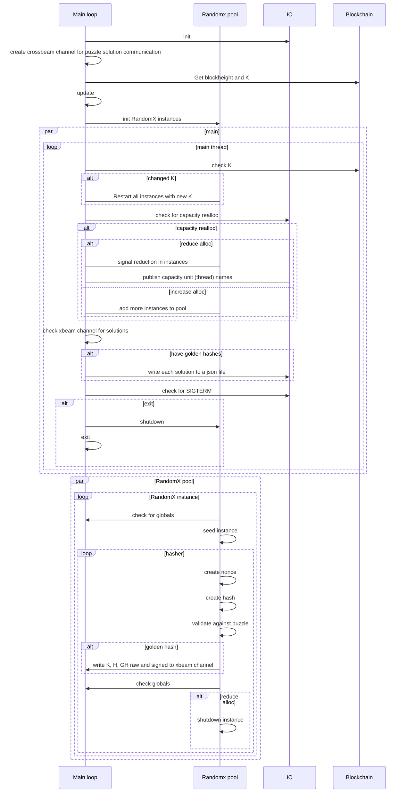

# RandomX PoW Wrapper

## Overview

The hardware capacity required to stand up the off-chain Fluence network is provided by a number of independent, high quality data centers including Filecoin Storage Providers (SP). en needed by serverless developers and their users, Fluence protocol incentivizes the commitment and provisioning of capacity to the network ahead of demand. The verification of such commitments is carried out by Fluence's Proof of Capacity (PoC). PoC is a set of solution components that in concert trigger the economic reward or slashing of providers.

Specifically, Fluence's Proof of Capacity is comprised of multiple components including:

* Proof of Work (PoW) component -- [RandomX](https://github.com/tevador/RandomX), off-chain
* PoW puzzle and difficulty component -- off-chain
* PoW proof generation component -- ZKP(s), off-chain
* Benchmarking framework -- off-chain
* EVM verifiers --  on-chain

[RandomX](https://github.com/tevador/RandomX) is the selected Proof of Work (PoW) system due to its production-grade maturity and GPU, FPGA and ASIC resistance. However, unlike the typical blockchain-based PoW, the Fluence use case does not follow the winner-takes-all (block) reward process. Instead, all participating capacity providers able to prove their capacity allocation, either through PoW or useful work (UW), are rewarded from treasury. Hence, special considerations to prevent replay attacks and capacity quality misrepresentation are in order.

Moreover, the Fluence protocol is first and foremost of utilizing provided capacity to carry out useful work (UW), i.e., the execution of paid serverless jobs, providers are enabled and encouraged to allocate capacity to either PoW or UW without losing out on incentives or having to re-stake. 

This wrapper code not only wraps RandomX PoW but handles the production of the K and N parameters to suit the Fluence protocol's needs as well as the dynamic deallocation and reallocation of capacity to PoW and UW. See Figure 1.

Figure 1: Stylized Execution Flow

## Design And Implementation: Assumptions And Considerations 

* Server -- capacity collection of cores, e.g., 64, and RAM, e.g., 1 TB
  * hosts Nox and this code
  * server id == peer id
  
* Compute unit
  * Designated a compute unit to be fine grained
  * one (1) thread, 2 GB RAM
  
* Compute unit id
  * mocked it in lieu of n-chain provisioning of those ids
  
* Capacity Reallocation
  * uses counter-based approach to in/decrease RandomX instances (but easily changed to named changes)

* 

* Minimize resource footprint of app
  * squeezed a lot into main thread

* Dependencies
  * current implementation uses [rust-randomx](https://crates.io/crates/rust-randomx) 0.7.2 wrapper
  * alternatively crate [randomx-rs](https://crates.io/crates/randomx-rs) is available
  * might be worth benchmarking the `rust-randomx` and `randomx-rs` crates

### RandomX Key K

Key K generation follows the Monero template: a valid K is the most recent block divisible by 2048 and 64; that is, K changes roughly change 2.1 days (2048 blocks * 90 minutes per confirmed block) when pulling from the FVM mainet with another 1.5 hours delay (64 * 90), see [keyblock.rs]("./keyblock.rs"). Hence, the Randomx instances get re-iniitated/re-started every 2.1 days or so.

In order to verifiably tie K to a RandomX instance and server, via peer id, the "actual" is the signed (hash) of the eligible key block and thread id:

    K = Sign(Keccak(block_height, thread_id))

 where thread id = Keccak(peer_id, idx) and currently mocked in lieu of on-chain generation. Of course, thread id can be easily adjusted to a core id or other compute unit definition. If K proof is part of a ZKP, the hashing of the inputs may be forgone in favor of a simple concatenated string as bytes for signing.

### RandomX Nonce H

In a prototypical PoW scenario, H is the nonce of the hashed blob of the proposed block making it unique and easily verifiable. In the Fluence PoC context an alternative approach is required. While a pseudo-random number would do, a nonce with additional signals, such as a monotonically increasing nonce. For example, 

### RandomX Puzzle And Difficulty

The implementation utilizes the leading zeros puzzle. The associated difficulty needs to be benchmarked across server configurations and the desired expected golden hash period/epoch. It should be noted that a shorter epoch allows providers to be more responsive to switch from PoW to UW due the lower expected loss of not completing a hashing epoch.

### Capacity Reallocation

An integral aspect of PoC is a provider's ability to reallocate capacity between PoW and UW as smoothly and efficiently as possible. As the capacity allocation to either PoW or UW is tracked on chain via a unique compute unit id, currently mocked as thread id, that maps to the compute unit's stake. That is, PoW capacity reallocated to UW is associated with a move of associated stake from PoW to UW bucket. Depending on the event model in place, capacity reallocation can be the trigger for on-chain actions and this event can be triggered from existing Nox methods.

The current implementation tracks the max capacity available and adjust for reallocation specified in the [runtime config]("./data/runtime_cfg.json") file. Changing the dealloc value up decreases the number of Randomx instances and down increases the number of running Randomx instances. That is, the main thread loop attempts ot balance the number of RandomX instances to the runtime configuration parameter value. While compute unit ids are used  via the [mocked]("./src/mcoks.rs") thread ids, the reallocation requests are expressed in counter integer. A named reallocation can be easily accommodated.

Note that allocation of available capacity to/from workers is outside the scope of this wrapper and needs to be handled by Nox.

## Optimization And Benchmarking Considerations

In order to prevent, or at least significantly limit, the abuse of the capacity incentive program, this application needs to be optimized as much as possible and extensively benchmarked. See [benchmarking](https://www.notion.so/fluencenetwork/Proof-of-Work-Benchmarking-Pre-FLIP-9f1b8cdf6ab94ab2a6a77b31e33b02de?pvs=4) for more info.

## Nox Integration And Distribution Considerations

* At various discussion points there has been a desire to bind PoW to particles. For example, the json rpc call in [keyblock.rs]("./src/keyblock.rs") could be an Aqua call to a Marine service or Decider spell. 

* Bundling PoW with Nox looks reasonable and in line with operator expectations
  
* Nox needs to integrate with PoW for capacity management, i.e., allocated freed capacity to workers and vice versa.
## Operational Considerations

Since each thread makes a provider money, considerations have been given to minimize the thread overhead of "operational" thread overhead. Hence, a lot of even monitoring loops have been squeezed into the main thread. 

## Summary
WIP

To Dos:  

- [ ] need to settle on compute unit sizing which depends to some extent on optimal worker sizing. i.e., if a worker utilizes an even number of threads, a core-based unit is feasible otherwise thread--based model is more appropriate
- [ ] identify and define required Nox interfaces  

